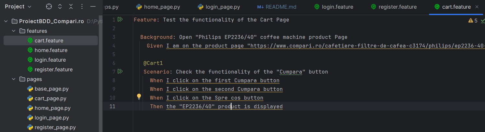

# Python_Automation_BDD_Selenium_CompariRo

### TESTED APPLICATION

https://compari.ro/

I chose to check the website Compari.ro, latform dedicated to comparing product prices. To make sure that all the functions work properly, we checked functionalities such as: register and login successfully, sending successful/error messages and validating the correctness of the message text, using valid/invalid email address/password, etc.

### LANGUAGE, IDE, BOOKSTORES
I chose to perform the testing using the Python programming language and the PyCharm IDE. I used the Selenium, webdriver-manager, behave and behave-html-formatter libraries to automate the interaction with the Comparo.ro website. The "Python Packages" section of PyCharm can be accessed to install these libraries. After adding the name of the desired library in the field, I pressed the "Install" button.

### THE IMPORTANCE OF AUTOMATED TESTING
Efficiency in software development depends on automated testing. Speed, reproducibility, extended coverage, reusability, ease of integration with agile development practices and early detection of errors are the main benefits. This constantly helps to ensure the quality of the software.

### THE CHOSEN METHODOLOGY
The software development methodology called BDD (Behavior-Driven Development) focuses on the collaboration of team members and on describing the behavior of the application in a simple language, such as Gherkin. We chose BDD to facilitate communication between developers, testers and other interested parties and to create automated tests that reflect the behavior clearly specified by stakeholders. Benefits include: clear communication, easy-to-understand and up-to-date tests, and alignment between requirements and implementation. BDD encourages teamwork and guarantees that development focuses on developing useful functionalities that meet user expectations.

### DESIGN PATTERN 
I chose to organize the code of the automated tests using the "Page Object Model" (POM). Reusability, encapsulation, ease of maintenance, readability and resistance to change are some of its benefits. POM improves the development and maintenance of automated tests and code structure.

### USE OF THE PROJECT
Using the project starts by cloning it from GitHub. Access the project, press the green *"Code"* button, copy the link, navigate on the computer to the desired folder, open *Git Bash*, write the command *"git clone"* followed by the link and press *"Enter"*. The cloned project can be opened in PyCharm. To run tests, use the command *"behave -f html -o report-testing_final_28.02.2024.html"* in the terminal. To view the generated report and wait for the test to run, open the generated report *"report-testing_final_28.02.2024.html"* in a desired browser to view the test results.

### STRUCTURE OF THE PROJECT
The project has a structure consisting of a series of files and directories. We find settings for opening Chrome, maximizing the window and a default wait of three seconds in the "browser" file. We have the structure of the pages tested in the "environment". "features", "pages" and "steps" are the three directories that make up the general structure. The test scenarios are written in Gherkin syntax and can be found in the "features" category. We have general methods for actions such as clicking, finding the element/elements, typing, etc. defined in "pages". The other files contain locators and specific methods for the suggested scenarios. The Gherkin syntax defines the functions of the "steps" directory. This structure organizes the code for automated tests.

### SCREENSHOTS WITH THE CODE

### SCENARIOS

Test scenarios chosen for evaluation include:

* Verification of successful registrations with valid data
* Checking registration error with invalid data
* Verification of successful login with valid data
* Checking login error with invalid data
* Checking the correctness of the URL address
* Checking functionalities such as search, filter, add to cart, compare product price

These scenarios cover a variety of situations to ensure that the key functionalities of the platform are tested exhaustively and that errors can be identified and handled accordingly.

